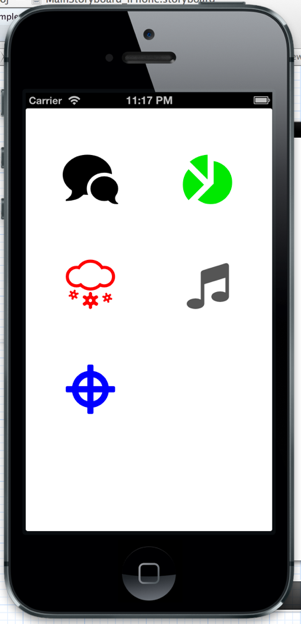

# IOS Ico Moon 

Use an ICOMoon generated icon font in your IOS app!

Font-awesome and other icon fonts are just awesome. ICOMoon (a web app that lets you hand pick
glyphs from multiple icon fonts and generate a custom font file that contains only the selected glyphs)
is beyond awesome!

Here is how I use that stuff in my apps:

## 1. Generate a custom icon font using the icomoon app 

* Go here: [http://icomoon.io/app/](http://icomoon.io/app/)
* Select icons from various font
* Click the Font button at the bottom to generate the font
* click download

For instance the sample font in the repo was generated by picking 5 icons from 5 different fonts, and it
is only 3KB (font-awesome alone is 65KB):


## 2. Generate code

* Extract the zip and go to the fonts sub-folder.
* Run the ```generateHeader.py``` python script provided in the repo...

This script will parse the ```icomoon.dev.svg``` file and create a new file
named ```IcomoonIcons.h```. This is hard-codedin the python script.
The generated files contains a bunch of #defines in it, one UTF code per glyph.

For instance, the previous icon set will generate these 5 #defines:

```C
#define  ICOMOON_BUBBLES "\uE000"
#define  ICOMOON_TARGET "\uE001"
#define  ICOMOON_SNOWY "\uE002"
#define  ICOMOON_MUSIC "\uF001"
#define  ICOMOON_CHART "\uE003"
```

# 3. Use it in your app

* Add the ```IcomoonIcons.h``` file and the ttf font file ```icomoon.ttf``` in your app project.
* Make sure your add an entry in your app ```info.plist``` for the ```icomoon.ttf``` font file 
("Fonts provided by application"/UIAppFonts row).
* Optionaly, add the ```IcoMoon.m``` and ```IcoMoon.h``` to your project. This class is a very simple class that imports the generated 
```IcomoonIcons.h``` and that contains only one helper method:

```obj-c
+(NSString *)iconString:(char *)icon
{
    NSString *string = [NSString stringWithUTF8String:icon];
    return string;
}
```

you could go by without it really, I just find
```obj-c 
[NSString stringWithUTF8String:ICOMOON_BUBBLES];
``` 
not as readable as
```obj-c 
[IcoMoon iconString:ICOMOON_BUBBLES];
```

In your app, you can now simply make a UILabel look like an icon:

```obj-c
[self.label setFont:[UIFont fontWithName:@"icomoon" size:64.0f]];
self.label.text = [IcoMoon iconString:ICOMOON_BUBBLES];
```

The key thing is to set the font to ```@"icomoon"```... 
Alternatively if you are using [NUI](https://github.com/tombenner/nui) as I am:

```
Label:BigIcon {
    font-name: icomoon;
    font-size: 64;
    text-align: center;
}
```



Run the ExampleApp iPhone app to see it in action.

I guess you could make the generation of the ```IcomoonIcons.h``` file a custom build phase 
so everything is updated after you update the font... Feel free to send me a pull request!